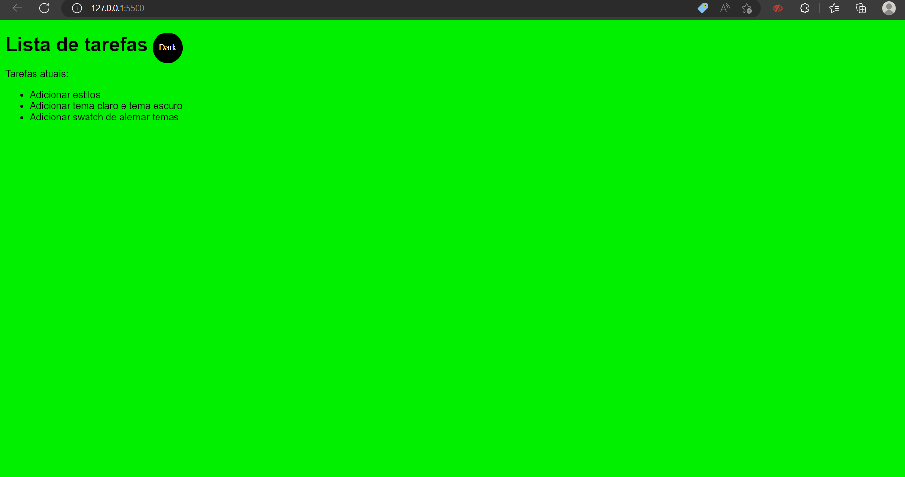
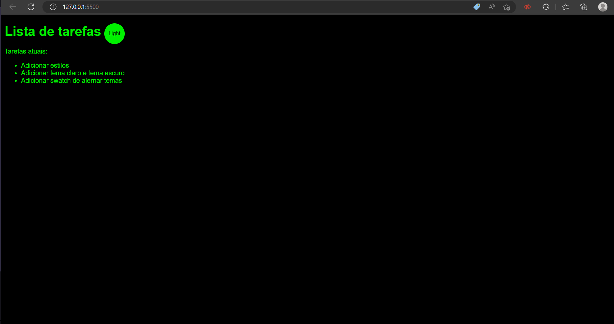

# Reinicio dos Estudos de  FrontEnd

## Site simples feito com auxílio do curso <a href="https://www.ev.org.br/cursos/crie-um-site-simples-usando-html-css-e-javascript">🔗 Criando site simples com HTML, CSS e JS<a>

### O site tem suporte ao dois tipos de tema:
* Tema claro

* Tema escuro
